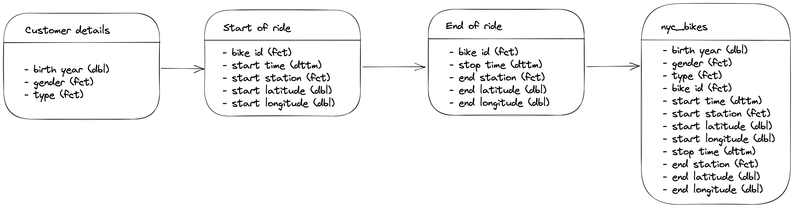

***
# 1. Documentation

## Domain Knowledge 1.1 

__NYC Citi Bikes__ is a bike share program which offers customers the opportunity to explore NYC and the surrounding areas by bike.
With over 1,500 stations and over 25,000 bikes, there is a __lot__ of data that could be collected and analysed in order to understand the trends of the customers using the bikes.

This report investigates and analyses the data of __10 NYC Citi Bikes__ that were used in the Jersey City area in 2018.

The following terms will be used across the entirety of this report:

- __Customer__: Someone who has purchased either a 24-hour or a 3-day pass
- __Subscriber__: Someone who has an annual subscription
- __KPI__: The Key Performance Indicator is to increase bike hires

The following points were considered for the report:

- What is the pattern of bike hires over time (e.g. within a year, month, week, or day)?
- Do bike hire patterns differ between bike rider demographics (e.g. gender, type of trip, age)?

## Business Requirements 1.2

To answer the above questions regarding pattern of hire over time and changing demographics, the following steps were taken:

1. Load in and study the data
2. Wrangle the data by manipulating the time-series columns
    - Create a Year column
    - Create a Month column
    - Create a Date column
    - Create a Day of Week column
    - Create a Season column
    - Create a Ride Duration column
3. Investigate the proportion of customer types (Customer v Subscriber)
4. Visualise the pattern of hire change over time
5. Visualise the pattern of bike rider demographics by customer type
6. Visualise the pattern of bike rider demographics by gender
7. Visualise the geographical spread of the start-points
8. Interpret the visualisations and make recommendations

## Business Processes and Data Flow 1.3

#### The below image displays the process used to create the `nyc_bikes` data set.



## Data Visualisation as a Tool for Decision Making 1.4

The intentions of the visualisations rendered for this report are to be able to give actionable insights into consumer behaviour patterns and how these could be used to make future business decisions. 

This report focuses on the monthly pattern of bike hires, and then the differences in customer types for these months. Plots were created to visualise if there were any patterns, and how these patterns could be used to guide business decisions. 

## Data Types 1.5

The following variables and data types were used in this report to create the visualisations. 

Variable Name      | Data Type
-------------      | ----------
bike_id            | < fct >
start_time         | < dttm >
stop_time          | < dttm >
start_station      | < fct >
start_lat          | < dbl >
start_long         | < dbl >
end_station        | < fct >
end_lat            | < dbl >
end_long           | < dbl >
type               | < fct >
birth_year         | < dbl >
gender             | < fct >
month_of_ride*     | < ord >
day_of_week_ride*  | < ord >
year_of_ride*      | < ord >
date*              | < date >
ride_duration*     | < dbl >
season*            | < ord >

> `* variables not included in the original dataset

## Data Quality and Data Bias 1.6

The scope of this report investigates the pattern of types of customers (Customer vs Subscriber) and therefore, data bias was not considered for the analysis. It is worth noting, however, that this data is taken from a very small sample of 10 bikes, based in Jersey City. Therefore, using the visualisations and analysis to make business recommendations should be done so with this in mind. The results that will be discussed could not, for example, be applied to Manhatten or Queens as the demographics there could be significantly different. 

***

# 2. Data Cleaning

## Preparing Data for Visualisations 1.7

The first step was to call in the appropriate libraries.

```{r eval=FALSE}
library(tidyverse)
library(janitor)
library(tsibble)
library(brew)
library(lubridate)
library(leaflet)
```


The dataset was then read in and `clean_names()` was applied to ensure variables followed tidy data principles.

```{r}
nyc_bikes <- tsibbledata::nyc_bikes %>% clean_names()
```


The data was then given an initial browse to check the dimensions and the variable names and types.

```{r}
glimpse(nyc_bikes)
```


The data was then checked to see if there was any missing data - there was not.

```{r eval=FALSE}
nyc_bikes %>% 
  filter(is.na(bike_id:gender))
```


Some more exploration was conducted to find the different types of customers, how many start stations there were, and what genders were listed.

```{r eval=FALSE}
nyc_bikes %>% 
  distinct(type)

nyc_bikes %>% 
  distinct(start_station)

nyc_bikes %>% 
  distinct(gender)
```


### Data Cleaning

There was some wrangling done to add the different columns that would be necessary to create visualisations and conduct relevant analysis.

The following variables were added to the data set:

- __month_of_ride__
- __day_of_week__
- __year_of_ride__
- __date__
- __ride_duration__
- __season__

To allow for seasonal analysis, the months of the year were grouped into the four seasons as follows:

* Spring
  + March
  + April
  + May
* Summer
  + June
  + July
  + August
* Autumn
  + September
  + October
  + November
* Winter    
  + December
  + January
  + February

```{r}
nyc_bikes <- nyc_bikes %>%
  mutate(month_of_ride = month(start_time, label = TRUE, abbr = FALSE),
         day_of_week_ride = wday(start_time, label = TRUE, abbr = TRUE),
         year_of_ride = year(start_time),
         date = as_date(start_time),
         ride_duration = as.numeric(as.period(stop_time - start_time), "minutes"),
         season = case_when(
           str_detect(month_of_ride, "December") ~ "Winter",
           str_detect(month_of_ride, "January") ~ "Winter",
           str_detect(month_of_ride, "February") ~ "Winter",
           str_detect(month_of_ride, "March") ~ "Spring",
           str_detect(month_of_ride, "April") ~ "Spring",
           str_detect(month_of_ride, "May") ~ "Spring",
           str_detect(month_of_ride, "June") ~ "Summer",
           str_detect(month_of_ride, "July") ~ "Summer",
           str_detect(month_of_ride, "August") ~ "Summer",
           str_detect(month_of_ride, "September") ~ "Autumn",
           str_detect(month_of_ride, "October") ~ "Autumn",
           str_detect(month_of_ride, "November") ~ "Autumn",
         ),
         season = factor(season, order = TRUE),
         .after = stop_time)

nyc_bikes
```


After the relevant wrangling was done and the new variables were explored in more detail, it was found that there were 3 ride durations that were extreme outliers that would adversely affect the visualisations and the analysis. It is unclear if these trips were a mistake, or possibly as a result of a bike not being returned properly, or some other technical issue, but it was decided that these should be removed for the purpose of the report. A value of 120 minutes was decided as the limit to filter at. On reflection, this could have been extended further to return a more accurate analysis.

```{r}
nyc_bikes %>% 
  index_by(year_of_ride) %>% 
  arrange(desc(ride_duration)) %>% 
  head(3)
```
### Filtering out the extreme outliers

```{r eval=FALSE}
nyc_bikes <- nyc_bikes %>% 
  filter(ride_duration <= 120)
```


***

# 3. Data Visualisation

## Process and Design 2.1, 2.7, 2.8, 2.9

The first step was to plot the distribution of ride duration to get a look at how the ride times differed throughout the year. The patterns of bike hire over time were then visualised by plotting the total number of bike rides, the total ride duration, and the mean ride duration for each month. These plots helped guide the focus of the report to look more closely at the mean ride duration and why this pattern differed. Customer type was the visualised on a bar graph to investigate the proportions of each type before the patterns were then plotted again, this time using the seasons as opposed to calender months, to get a more high-level overview of these patterns. Doing so helped to further lead the direction of the report as there was a clear pattern and difference in mean time v total time and difference in behaviour of customer types. The patterns were then plotted once more, this time accounting for customer type, to look at the difference in behaviour and what was driving the differences. 

All plots were formatted with the official colours the Citi Group and were made in RStudio using `ggplot`.

## Visualisations 2.2, 2.3, 2.4, 2.5, 2.6

***
> ##### Plot Type: Histogram
> ##### Purpose: Plot the distribution of ride durations


```{r echo=FALSE}
nyc_bikes %>%
  ggplot(aes(x = ride_duration)) +
  geom_histogram(bins = 100, col = "white", fill = "#003A72") +
  scale_x_log10() +
  theme_light() +
  labs(x = "\nRide Duration (minutes)",
       y = "Count",
       title = "Distribution of Ride Duration\n")
```
This histogram shows the distribution of bike ride durations for the 10 bikes in 2018. The blue bins show the distribution of ride duration in minutes, on a scale log 10 axis for visualisation purposes.

The plot displays a unimodal, right-skewed distribution, peaking at a value of around 7. This was used to guide the visualisations of further plots.

***
> ##### Plot Type: Line Graph
> ##### Purpose: Plot number of bike hires per month

```{r echo=FALSE}
monthly_hires <- nyc_bikes %>% 
  index_by(month_of_ride) %>% 
  summarise(count = n())

monthly_hires %>% 
  ggplot(aes(x = month_of_ride,
             y = count,
             label = count)) +
  geom_point(colour = "#003A72", size = 2) +
  geom_line(group = 1, colour = "#DB230B")+
  geom_text(vjust = -0.25, hjust = 1) +
  theme_light() +
  labs(x = "\nMonth of Year",
       y = "Number of Bike Rides",
       title = "Number of Bike Rides per Month\n")
```
This line graph shows the __monthly pattern__ of bike hires for 2018. The total number of bike rides was plotted against the month of the year to return a line graph. 

It can clearly be seen that there is a dramatic upwards trend in total bike hires from March through to August, peaking at 728 hires, before falling steeply during the final 4 months of the year. The pattern is important as this trend can be further analysed and explored to see what is driving this visualisation, and if any actionable recommendations could be provided to Citi Bike.

***
> ##### Plot Type: Line Graph
> ##### Purpose: Plot the total ride duration over the months

```{r echo=FALSE}
nyc_bikes %>%
  index_by(month_of_ride) %>%
  summarise(sum_monthly_ride_time = sum(ride_duration)) %>% 
  ggplot(aes(x = month_of_ride,
             y = sum_monthly_ride_time)) +
  geom_point(colour = "#003A72", size = 2) +
  geom_line(group = 1, colour = "#DB230B")+
  theme_light() +
  labs(x = "\nMonth of Year",
       y = "Total Ride Duration (minutes)",
       title = "Ride Duration per Month\n")
```
This line graph shows the __total__ ride duration of the 10 bikes for the months in 2018. Again, ride duration is plotted against the calender months.

The pattern which emerges from this line graph is very similar to the one above, and this should be expected. As the number of rides increases, logic would follow that the total ride duration would increase. This graph further illustrates the pattern of bike hire over time and that the middle months of the year are by far the busiest. 

***
> ##### Plot Type: Line Graph
> ##### Purpose: Plot the mean ride duration over the months


```{r echo=FALSE}
nyc_bikes %>%
  index_by(month_of_ride) %>%
  summarise(mean_monthly_ride_time = mean(ride_duration)) %>% 
  ggplot(aes(x = month_of_ride,
             y = mean_monthly_ride_time)) +
  geom_point(colour = "#003A72", size = 2) +
  geom_line(group = 1, colour = "#DB230B")+
  theme_light() +
  labs(x = "\nMonth of Year",
       y = "Mean Ride Duration (minutes)",
       title = "Mean Ride Duration per Month\n")
```
This line graph shows the __mean__ ride duration of the 10 bikes for the months in 2018.

The mean pattern is different to the total duration, and number of hires, which suggests that there is data which is driving this change and affecting the expected pattern. The difference between the months is far smaller than when the total ride duration was plotted which suggests that there is a customer behaviour that is affecting this. 

***
> ##### Plot Type: Bar Chart
> ##### Purpose: Plot the proportion of customer types


```{r echo=FALSE}
nyc_bikes %>% 
  mutate(type = factor(type, order = TRUE)) %>% 
  index_by(type) %>% 
  summarise(count = n()) %>% 
  ggplot(aes(x = type,
         y = count)) +
  geom_col(aes(fill = type),
           alpha = 0.8) +
  scale_x_discrete(limits = c("Customer", "Subscriber")) +
  scale_fill_manual(values = c("#003A72", "#DB230B")) +
  geom_text(aes(label = paste0(round(count / sum(count) * 100, digits = 1), "%")), vjust = -0.25)+
  theme_light() +
  theme(legend.position = "none") +
  labs(x = "\nCustomer Type",
       y = "Number of Customers",
       title = "Number of Customer Types\n")
```
This bar chart shows the __proportion__ of customer types from this data set.

The plot shows that a huge majority of the customers in this data set are __subscribers__. Because of this massive proportion, the patterns and behaviours of the subscribers need to be investigated further. 
***
> ##### Plot Type: Bar Chart
> ##### Purpose: Plot the number of bike rides for both customer types per season


```{r, echo=FALSE}
nyc_bikes %>% 
  index_by(season) %>%
  group_by(type) %>% 
  summarise(count = n()) %>% 
  ggplot(aes(x = season,
             y = count)) +
  geom_col(aes(fill = type),
           alpha = 0.8, position = "dodge") +
  scale_x_discrete(limits = c("Spring", "Summer", "Autumn", "Winter")) +
  scale_fill_manual(values = c("#003A72", "#DB230B")) +
  theme_light() +
  labs(x = "\nSeason",
       y = "Number of Bike Rides",
       title = "Number of Bike Rides per Season\n",
       fill = "Customer Type")
```
This bar chart shows the __number of bike hires__ of customer types from this data set. Here, the pattern is shown over the 4 seasons. 

The plot shows the big difference in the number of hires between __subscribers__ and __customers__. 

***

> ##### Plot Type: Line Graph
> ##### Purpose: Plot the mean ride duration for each month for both customer types


```{r echo=FALSE}
nyc_bikes %>%
  index_by(month_of_ride) %>%
  group_by(type) %>% 
  mutate(mean_monthly_ride_time = mean(ride_duration)) %>% 
  ggplot(aes(x = month_of_ride,
             y = mean_monthly_ride_time)) +
  geom_point(size = 1) +
  geom_line(aes(group = type, colour = type)) +
  scale_color_manual(values = c("#003A72", "#DB230B")) +
  theme_light() +
  labs(x = "\nMonth of Year",
       y = "Mean Ride Duration (minutes)",
       title = "Mean Ride Duration per Month by Customer\n",
       colour = "Customer Type")
```
This line graph shows the stark difference in behaviour pattern of the different customer types.

The subscriber has a very steady mean ride duration throughout the months of the year, which is not in keeping with the seasonal pattern visualised above. It can be seen that the mean ride does not change a huge amount throughout the year and suggests that the subscribers are possibly using the bikes for commuting. This insight can be used to make recommendations. 

The customer has a much larger and more varied mean throughout the year and tends to follow the seasonal pattern. The mean also mostly falls below 30 minutes per month which is the upper limited of the "unlimited" time offered by the package. These insights could again be used for recommendations.
***
> ##### Plot Type: Bar Chart
> ##### Purpose: Plot the total ride duration for both customer types per season


```{r, echo=FALSE}
nyc_bikes %>%
  index_by(season) %>%
  group_by(type) %>% 
  summarise(sum_season_ride_time = sum(ride_duration)) %>%
  ggplot(aes(x = season,
             y = sum_season_ride_time)) +
   geom_col(aes(fill = type),
            alpha = 0.8, position = "dodge") +
  scale_x_discrete(limits = c("Spring", "Summer", "Autumn", "Winter")) +
  scale_fill_manual(values = c("#003A72", "#DB230B")) +
  theme_light() +
  labs(x = "\nSeason",
       y = "Total Ride Time (minutes)",
       title = "Total Ride Time per Season\n",
       fill = "Customer Type")
```
This bar chart shows the __total__ ride duration of customer types from this data set. Here, the pattern is shown over the 4 seasons. 

This plot is very similar to the one above, and that further displays the close link between total hires and total ride duration. 

***
> ##### Plot Type: Bar Chart
> ##### Purpose: Plot the mean ride duration for both customer types per season


```{r, echo=FALSE}
nyc_bikes %>% 
  index_by(season) %>%
  group_by(type) %>% 
  summarise(mean_seasonal_ride_time = mean(ride_duration)) %>% 
  ggplot(aes(x = season,
             y = mean_seasonal_ride_time)) +
  geom_col(aes(fill = type),
           alpha = 0.8,
           position = "dodge") +
  scale_x_discrete(limits = c("Spring", "Summer", "Autumn", "Winter")) +
  scale_fill_manual(values = c("#003A72", "#DB230B")) +
  theme_light() +
  labs(x = "\nSeason",
       y = "Mean Ride Time (minutes)",
       title = "Mean Ride Time per Season\n",
       fill = "Customer Type")
```
This bar chart shows the __mean__ ride duration of customer types from this data set. Here, the pattern is shown over the 4 seasons. 

The plot here shows the main difference in customer behaviours of the __subscribers__ and __customers__. It can clearly be seen that the customer rides, on average, for far longer than the subscriber. This is a valuable insight for Citi Bike as they can tailor their offers and advertising at these two groups of customers. 

***
> ##### Plot Type: Line Graph
> ##### Purpose: Plot total ride duration per month for both customer types


```{r echo=FALSE}
nyc_bikes %>% 
  index_by(month_of_ride) %>%
  group_by(type) %>% 
  mutate(sum_monthly_ride_time = sum(ride_duration)) %>% 
  ggplot(aes(x = month_of_ride,
             y = sum_monthly_ride_time)) +
  geom_point(size = 1) +
  geom_line(aes(group = type, colour = type)) +
  scale_color_manual(values = c("#003A72", "#DB230B")) +
  theme_light() +
  labs(x = "\nMonth of Year",
       y = "Total Ride Duration (minutes)",
       title = "Total Ride Duration per Month by Customer\n",
       colour = "Customer Type")
```
This line graph further illustrates the point above about the difference in total ride duration between the types of customers. As the subscriber makes up over 90% of the data set, it would be expected that the total pattern was similar to the initial line graphs that were visualised.
***

> ##### Plot Type: Geospatial using Leaflet
> ##### Purpose: Plot the geographical spread of the start stations


```{r}
leaflet(nyc_bikes) %>% 
  addTiles() %>% 
  addMarkers(
    lng = ~start_long,
    lat = ~start_lat,
    popup = ~paste("Station:", start_station)
  )
```

Finally, this interactive geospatial map was created using leaflet. Around half of the start stations are in the metropolitan area of Jersey City, further suggesting that many of the subscirbers are using the bikes for a short term for possibly commuting. This geographical spread can again be used to make changes and recommendations.


